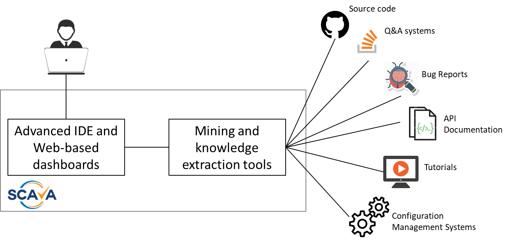
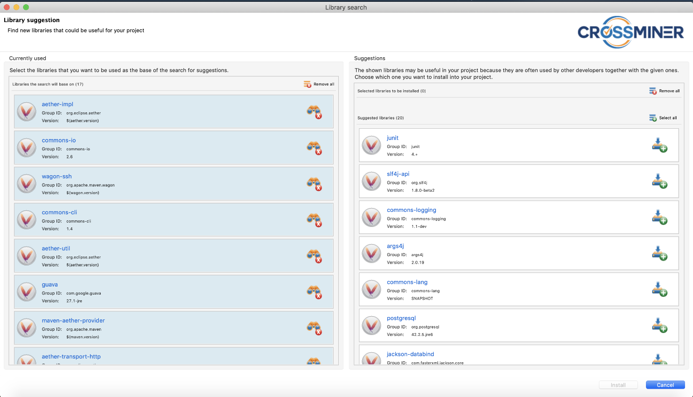
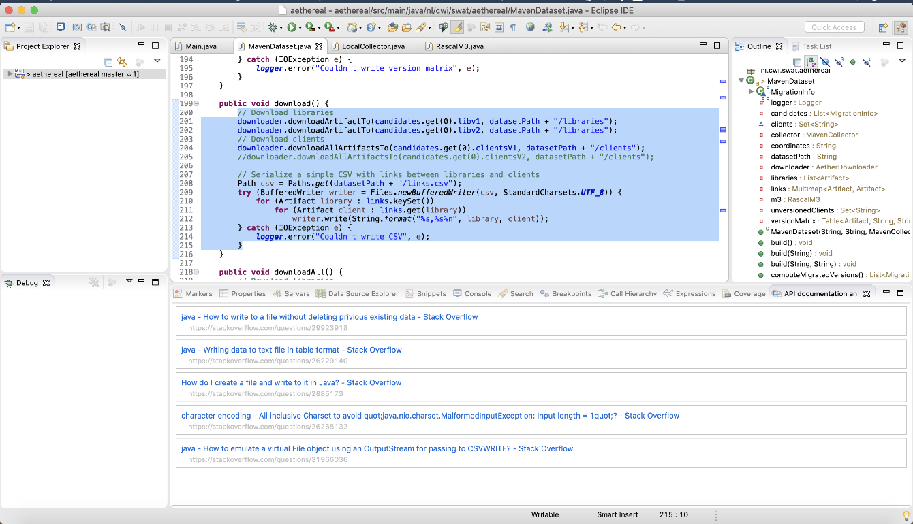
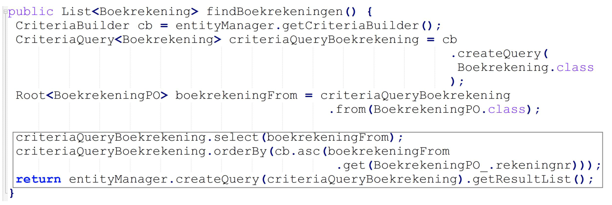
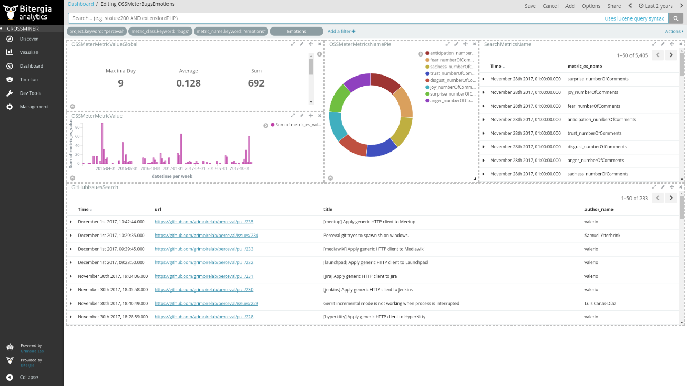

# Eclipse SCAVA

Eclipse SCAVA is an **open-source platform** for automatically **analysing** the source code, bug tracking systems, and communication channels of **open source software projects**. Eclipse SCAVA provides techniques and tools for extracting knowledge from existing open source components and use such knowledge to support the selection and reuse of existing software to develop new systems, and to provide developers with real-time recommendations that are relevant to the current development task. 

Eclipse SCAVA is a result of the European project CROSSMINER. [CROSSMINER project](https://www.crossminer.org/) receives funding under the European Union's Horizon 2020 Research and Innovation Programme under grant agreement No. 732223. 

As shown below Eclipse SCAVA is conceptually in between the developer and all the different and heterogenous data sources that one needs to interact with when understanding and using existing open source components.

Recommender systems typically implement four main activities i.e., data pre-processing, capturing context, producing recommendations, presenting recommendations. In this respect, both the Eclipse-based IDE and the Web-based dashboards make use of data produced by the mining tools working on the back-end of the Eclipse SCAVA infrastructure. 

The developer context is used as query sent to the knowledge base that answers with recommendations that are relevant with respect to the developer contexts. **Machine learning techniques** are used to infer knowledge underpinning the creation of relevant real-time recommendations. The knowledge base infers more insights from raw data produced by the different mining tools, which are the following:

- *Source code miners* to extract and store actionable knowledge from the source code of a collection of open-source projects;

- *NLP miners* to extract quality metrics related to the communication channels, and bug tracking systems of OSS projects by using Natural Language Processing and text mining techniques;

- *Configuration miners* to gather and analyse system configuration artefacts and data to provide an integrated DevOps-level view of a considered open source project;

- *Cross-project miners* to infer cross-project relationships and additional knowledge underpinning the provision of real-time recommendations;

Additionally, Eclipse SCAVA provide the means to simplify the development of bespoke analysis and knowledge extraction tools by contributing a framework that will shield engineers from technological issues and allow them to concentrate on the core analysis tasks instead.

## The SCAVA Eclipse-based IDE and Web-based Dashboards 

The Eclipse SCAVA technical offering consists of several components that can be either singularly used or developers can benefit integrated ways of using them via an Eclipse-based IDE and Web-based dashboards. Recommendation examples that Eclipse SCAVA is able to produce are shown in the following.

### Recommending additional libraries

As shown below, depending on the set of third-party libraries, which are currently used by the project being developed, the system can recommend additional libraries that should be included. Such recommendations are based on the similarity of the considered project with respect to already existing and analysed ones.  

### Recommending API documentation

Depending on the set of selected libraries, the system shows API documentation and Q&A posts that can help developers to understand how to use the selected libraries. The figure below shows a list of ranked StackOverflow posts that are recommended with respect to their relevance with the selected source code directly in the editor.

### Recommending API function calls and usage patterns

Eclipse SCAVA is also able to recommend API function calls that developer might need to add in the method being developed. For instance, the figure below contains a representative example where the `findBoekrekeningen` method queries the available entities and retrieve those of type `Boekrekening`. To this end, the Criteria API library is used. The situation shown below is when the development is at an early stage and the developer already used some methods of the chosen API to develop the required functionality. However, she is not sure how to proceed from this point. In such cases, different sources of information may be consulted, such as StackOverflow, video tutorials, API documentation, etc. For instance, by providing the first three statements of the `findBoekrekeningen` method declaration, Eclipse SCAVA can provide developers with recommendations consisting of a list of API method calls that should be used next, and with code snippets that could support developers in completing the method definition with the framed code in the figure below.

### Web-based dashboards

Eclipse SCAVA dashboards present up to date, high level, and quantitative panoramic views of analysed projects.  They include specific metrics for tracking key performance aspects and show details like who and how is contributing to a given project.  Dashboard panels show summary, aggregated and evolutionary data, statistical analysis, faceted views, etc. for each data source. The interface allows drilling down into the data combining different filters (time ranges, projects, repositories, contributors). NLP analysis tools can be also applied to retrieve all the sentiments related to the analysed projects. For instance, the figure below shows and interactive Wheel of Emotions that can be used to filter the sentiments to be shown in the dashboard.

## Eclipse SCAVA guides

### [Eclipse SCAVA Installation and User Guide](installation-and-user-guide/index.md)
The SCAVA Installation and User Guide provides instructions on how to install and configure the CORSSMINER Platform on a server and how to deploy the Eclipses Plugin in development environment. Moreover, it provides general instruction to analyse open sources repository using the platform, visualise the collected data using the visualisation dashboard and access to analysis service provided by the platform by the intermediary of the eclipse plugin.

### [Eclipse SCAVA Developers Guide](developers-guide/index.md)
The developers guide is dedicated to who peoples which went to extend the capability of the platform or integrate external tools by the intermediary of the public REST API.

### [Eclipse SCAVA Contributors Guide](contributors-guide/index.md)
The SCAVA Contributors guide contains all the material related to the architecture of the platform which could be useful for projects members and external open sources contributors.

---

## Useful links

* EU H2020 CROSSMINER project: [CROSSMINER](https://crossminer.org)
* Eclipse SCAVA home project: [Eclipse SCAVA @ Eclipse](https://projects.eclipse.org/projects/technology.scava)
* Eclipse SCAVA code repository: [github.com/eclipse-researchlabs/scava](https://github.com/eclipse-researchlabs/scava)
* Eclipse SCAVA deployment repository: [github.com/eclipse-researchlabs/scava-deployment](https://github.com/eclipse-researchlabs/scava-deployment)
* Eclipse SCAVA documentation repository: [github.com/eclipse-researchlabs/scava-docs](https://github.com/eclipse-researchlabs/scava-docs)

<!---
---

* [Old Stuf](others/index.md) : Documentation which must be migrated on one of the platfomrs guides

Migrated.
-->
